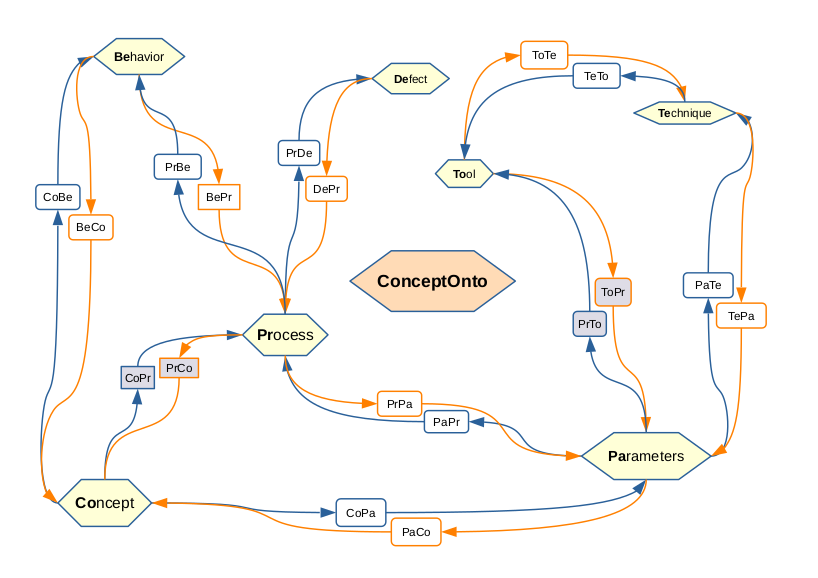

# ConceptOnto

This page is under construction. Please bear. -Phanikumar, October 2020

Here we document the ontology ConceptOnto which builds on the [skos](http://www.w3.org/2004/02/skos/core) vocabulary. This ontology will represent the following aspects of Materials Domain: Materials Concepts, Material Behavior, Material Parameters, Tools, Techniques, Materials Processes and Material Defects. These are implemented as concept schemes. All the instances are organized in a hierarchy of concepts. The different classes defined in this ontology and the relationships will be detailed here. 

Following prefix is used for individuals in this page. All the instances in the ConceptOnto ontology will also be in this space. You can pick up the OWL file from here (under construction).

      PREFIX mc: <http://semantic.iitm.ac.in/ConceptOnto#>

Other prefixes used in this ontology are as follows.

      PREFIX rdf: <http://www.w3.org/1999/02/22-rdf-syntax-ns#>
      PREFIX rdfs: <http://www.w3.org/2000/01/rdf-schema#>
      PREFIX xsd: <http://www.w3.org/2001/XMLSchema#>
      PREFIX owl: <http://www.w3.org/2002/07/owl#>
      PREFIX skos: <http://www.w3.org/2004/02/skos/core#>

## Classes
We use only two classes, namely skos:Concept and skos:ConceptScheme. Individuals in the name space mc: that correspond to concepts of various kind are instances of skos:Concept. Individuals in the name space mc: that correspond to the scheme of categorization are instances of skos:ConceptScheme.

The schemes of categorization are described below in detail.

### Materials Behavior
All concepts that come under Materials Behavior such as physical / chemical phenomena will be categorized under the following scheme.

     mc:MaterialsBehavior rdf:type skos:ConceptScheme

For example, solidification is a material behavior concept. This is expressed as:

     mc:Solidification rdf:type skos:Concept
     mc:Solidification skos:inScheme mc:MaterialsBehavior

Broader / narrower concepts are described using the skos vocabulary. For example:

     mc:AlloySolidification rdf:type skos:Concept
     mc:AlloySolidification skos:inScheme mc:MaterialsBehavior
     mc:AlloySolidification skos:broader mc:Solidification

The following instances are listed as top concepts for the scheme mc:MaterialsBehavior as points of entry for navigation.

     mc:MaterialsBehavior skos:hasTopConcept mc:Deformation
     mc:MaterialsBehavior skos:hasTopConcept mc:Diffraction
     mc:MaterialsBehavior skos:hasTopConcept mc:Diffusion
     mc:MaterialsBehavior skos:hasTopConcept mc:PhaseChange
     mc:MaterialsBehavior skos:hasTopConcept mc:ThermodynamicEquilibrium
     mc:MaterialsBehavior skos:hasTopConcept mc:TransportPhenomena

Any behavior that a material undergoes / exhibits can be listed in this scheme.

### Materials Concept

All concepts that indicate a physical understanding or representation of a behavior are captured in the scheme of categorization MaterialsConcept. 

      mc:MaterialsConcept rdf:type skos:ConceptScheme

For example, Bragg's law is a concept. This is expressed as:

      mc:BraggLaw rdf:type skos:Concept
      mc:BraggLaw skos:inScheme mc:MaterialsConcept
      mc:BraggLaw skos:broader mc:Laws

The following instances are listed as top concepts for the scheme mc:MaterialsConcept as points of entry for navigation.

      mc:MaterialsConcept skos:hasTopConcept mc:Criteria
      mc:MaterialsConcept skos:hasTopConcept mc:DimensionlessNumbers
      mc:MaterialsConcept skos:hasTopConcept mc:Effects
      mc:MaterialsConcept skos:hasTopConcept mc:Equations
      mc:MaterialsConcept skos:hasTopConcept mc:Laws
      mc:MaterialsConcept skos:hasTopConcept mc:Mechanisms
      mc:MaterialsConcept skos:hasTopConcept mc:Models
      mc:MaterialsConcept skos:hasTopConcept mc:Theorems
      mc:MaterialsConcept skos:hasTopConcept mc:Theory
      mc:MaterialsConcept skos:hasTopConcept mc:Relation
      mc:MaterialsConcept skos:hasTopConcept mc:Rules

Any theoretical knowledge that describes a material behavior or phenomenon can be listed in this scheme.

### Materials Defect

Defects that typically arise out of materials processing are listed under this scheme. 

      mc:MaterialsDefect rdf:type skos:ConceptScheme

For example, Chevron cracking is a defect that arises during extrusion process. This defect can be categorized as follows:

      mc:ChevronCracking rdf:type skos:Concept
      mc:ChevronCracking skos:inScheme mc:MaterialsDefect
      mc:ChevronCracking skos:broader mc:ExtrusionDefect

The following instances are listed as top concepts for the scheme mc:MaterialsDefect as points of entry for navigation.

      mc:MaterialsDefect skos:hasTopConcept mc:DrawingDefect
      mc:MaterialsDefect skos:hasTopConcept mc:ExtrusionDefect
      mc:MaterialsDefect skos:hasTopConcept mc:CastingDefect

### Materials Parameters

Parameters or variables of all kinds are listed under this scheme.

      mc:MaterialsParameters rdf:type skos:ConceptScheme

For example, Thermal Diffusivity is a Materials Parameter. This can be categorized as follows:

      mc:ThermalDiffusivity rdf:type skos:Concept
      mc:ThermalDiffusivity skos:inScheme mc:MaterialsParameter
      mc:ThermalDiffusivity skos:broader mc:ThermoPhysicalProperty

The following instances are listed as top concepts for the scheme mc:MaterialsParameters as points of entry for navigation.

      mc:MaterialsParameters skos:hasTopConcept mc:UniversalConstants
      mc:MaterialsParameters skos:hasTopConcept mc:Descriptor
      mc:MaterialsParameters skos:hasTopConcept mc:ProcessCondition
      mc:MaterialsParameters skos:hasTopConcept mc:ThermoPhysicalProperty

### Materials Processing

The hierarchy of materials processing techniques including manufacturing processes is categorized in this scheme.

      mc:MaterialsProcessing rdf:type skos:ConceptScheme

For example, GTAW is a Materials Processing concept. This can be categorized as follows:

      mc:GTAW rdf:type skos:Concept
      mc:GTAW skos:inScheme mc:MaterialsProcessing
      mc:GTAW skos:broader mc:ArcWelding

The following instances are listed as top concepts for the scheme mc:MaterialsProcessing as points of entry for navigation.

      mc:MaterialsProcessing skos:hasTopConcept mc:AdditiveProcesses
      mc:MaterialsProcessing skos:hasTopConcept mc:BulkDeformationProcesses
      mc:MaterialsProcessing skos:hasTopConcept mc:CastingProcesses
      mc:MaterialsProcessing skos:hasTopConcept mc:Grinding
      mc:MaterialsProcessing skos:hasTopConcept mc:HeatTreatment
      mc:MaterialsProcessing skos:hasTopConcept mc:HighEnergyRateForming
      mc:MaterialsProcessing skos:hasTopConcept mc:Machining
      mc:MaterialsProcessing skos:hasTopConcept mc:SheetMetalWorking
      mc:MaterialsProcessing skos:hasTopConcept mc:Welding

Any manufacturing process can be listed in this scheme under appropriate individual to preserve the hierarchy.

### Materials Technique

We understand the difference between a tool and a technique as follows: "A tool offers a technique that allows for determination of a parameter". A tool is like an experimental equipment or a computational software while a technique refers to the methodology employed by the tool to determine a materials parameter. 

Materials techniques are referred to be under the following scheme.

      mc:MaterialsTechnique rdf:type skos:ConceptScheme

For example, CALPHAD is a technique employed by software such as Thermo-Calc to calculate thermodynamic parameters.

      mc:CALPHAD rdf:type skos:Concept
      mc:CALPHAD skos:inScheme mc:MaterialsTechnique

The following instances are listed as top concepts for the scheme mc:MaterialsTechnique as points of entry for navigation.

      mc:MaterialsProcessing skos:hasTopConcept mc:DataAnalysis
      mc:MaterialsProcessing skos:hasTopConcept mc:CALPHAD
      mc:MaterialsProcessing skos:hasTopConcept mc:Measurement
      mc:MaterialsProcessing skos:hasTopConcept mc:SolutionOfPDE

Any procedure or methodology to calculate a parameter can be listed in this scheme.

### Materials Tool

A tool can be either Computational or Experimental in nature. All tools that are used to determine a materials parameter can be listed in this scheme.

      mc:MaterialsTool rdf:type skos:ConceptScheme

In this scheme, we list tools in a hierarchy as follows.

      mc:ThermoCalc rdf:type skos:Concept
      mc:ThermoCalc skos:inScheme mc:MaterialsTool
      mc:ThermoCalc skos:broader mc:ComputationalTools
      mc:DifferentialScanningCalorimeter rdf:type skos:Concept
      mc:DifferentialScanningCalorimeter skos:inScheme mc:MaterialsTool
      mc:DifferentialScanningCalorimeter skos:broader mc:ExperimentalTools

The following instances are listed a s top concepts for this scheme as points of entry for navigation.

      mc:MaterialsTool skos:hasTopConcept mc:ExperimentalTools
      mc:MaterialsTool skos:hasTopConcept mc:ComputationalTools

## Object properties

We have created 7 schemes of categorizing the concepts in the materials domain. If we wish to map every possible pair, the number of object relationship would be a large number. Here we define relations between those pairs of schemes that are most commonly related in materials domain.

The rationale for naming the relationships is as follows. We take the first two characters of the schemes in which the subject and object are categorized to create the name while the relation rdfs:label will point to the full name of the relationship. 

Eg., CoPa would be a name for the predicate (relationship) that would have **Co**ncept as subject and **Pa**rameter as object. Following is a list of relationships that are created in the name space mc: for convenience of relating various categories of concepts in this ontology.

I recommend that the relationship be mapped to the broadest concept possible. This is because, as you would see below, a super class axiom is used pass on the relationship to the concepts that are narrower to the object to which the original relationship is asserted. A reasoning engine such as Pellet would then provide the entailments as applicable. The section on transitive relations has examples to explain this better.

The statements that can be constructed using the triple "subject-predicate-object" with the help of rdfs:label will sound very close to (albeit not perfect) English sentences.

The Domain and Range for all the object properties we defined in this ontology is skos:Concept. 

### Concept + Parameter

Concepts have equations involving Parameters. 

      mc:CoPa rdfs:label "concept involved in equation for parameter"
      Source is a concept listed in scheme mc:MaterialsConcept
      Target is a concept listed in scheme mc:MaterialsParameter

For example, the concepts of non-dimensional numbers can be related to thermophysical parameters that are contained in them as follows.

      mc:BiotNumber mc:CoPa mc:ThermalConductivityOfSolid
      mc:FourierNumber mc:CoPa mc:ThermalDiffusivity

When rendered using the rdfs:label, the above to axioms would appear to be as follows:

      "Biot number" "concept involved in equation for parameter" "Thermal conductivity of solid"
      "Fourier number" "concept involved in equation for parameter" "Thermal diffusivity"

The inverse property is defined as follows.

      mc:PaCo rdfs:label "parameter involved in equation for concept"
      mc:PaCo owl:inverseOf mc:CoPa

### Concept + Behavior

Certain **Co**ncepts or equations or conditions are applicable during certain physical **Be**havior of materials. 

      mc:CoBe rdfs:label "concept is applicable during material behavior"

An example instance is as follows:

      mc:AvramiEquation mc:CoBe mc:PhaseChange
      mc:AbsoluteStabilityCriterion mc:CoBe mc:RapidSolidification

When rendered using the rdfs:label, the above axioms would read as follows:

      "Avrami equation" "concept is applicable during material behavior" "Phase change"
      "Absolute Stability Criterion" "concept is applicable during material behavior" "Rapid solidification"

Conversely, a material **Be**havior could invole a certain **Co**ncept as per our understanding.

      mc:BeCo rdfs:label "material behavior could involve concept"
      mc:BeCo owl:inverseOf mc:CoBe

### Defect + Process

Often, **De**fects in materials arise out of certain **Pr**ocesses.

      mc:DePr rdfs:label "defect forms in process"

Here are few examples of defects that typically form in certain processes.

      mc:ChevronCracking mc:DePr mc:DirectExtrusion
      mc:CoreShift mc:DePr mc:SandCasting

When rendered using the rdfs:label, the above axioms would read as follows:

     "Chevron cracking" "defect forms in process" "Direct extrusion"
     "Core shift" "defect forms in process" "Sand casting"

Conversely, certain defects form in certain processes.

      mc:PrDe rdfs:label "process leads to defect"
      mc:DePr owl:inverseOf mc:PrDe

### Parameter + Process

Processes are described by parameters. Conversely, parameters are conditions of a process.

      mc:PrPa rdfs:label "process described by parameter"
      mc:PaPr rdfs:label "parameter is condition of process"
      mc:PrPa owl:inverseOf mc:PaPr

Here is an example of usage of this relation.

      mc:CoolingRate mc:PaPr mc:MeltSpinning

When rendered using rdfs:label, this axiom would read as follows:

      "Cooling rate" "parameter is condition of process" "Melt spinning"

### Tool + Technique

Tools offer techniques. 

      mc:ToTe rdfs:label "tool offers technique" 

Example:

      mc:ThermoCalc mc:ToTe mc:CALPHAD
      mc:OpticalMicroscope mc:ToTe mc:QuantitativeMetallography

When rendered using the rdfs:label, the above axioms would read as follows:

      "Thermo-Calc suite" "tool offers technique" "CALPHAD"
      "Optical microscope" "tool offers technique" "Quantitative metallography"

Conversely, a technique is offered by a tool.

      mc:TeTo rdfs:label "technique offered by tool" 
      mc:ToTe owl:inverseOf mc:TeTo

Conversely, techniques are offered by tools.

      mc:offersTechnique has mc:Tool as Domain and mc:Technique as Range
      mc:offeredByTool is an inverse of this property

### Technique + Parameter

Techniques provide for calculation or measurement of parameters. 

      mc:TePa rdfs:label "technique determines parameter"

Following are few examples.

      mc:CALPHAD mc:TePa mc:MolarVolume
      mc:QuantitativeMetallography mc:TePa mc:GrainSize

When rendered using the rdfs:label, the above axioms would read as follows:

      "CALPHAD" "technique determines parameter" "Molar volume"
      "Quantitative metallography" "technique determines parameter" "Grain size"

Conversely, parameter measurements are provided by certain techniques.

      mc:PaTe rdfs:label "parameter determined by technique"
      mc:TePa owl:inverseOf mc:PaTe

### Behavior + Process

Certain behavior of materials take place during certain processes. 

      mc:BePr rdfs:label "material behavior takes place during process"

Following are few examples.

      mc:RapidSolidification mc:BePr mc:MeltSpinning

When rendered using rdfs:label, the above axiom would read as follows:

      "Rapid solidification" "material behavior takes place during process" "Melt spinning"

Conversely, certain processes involve certain behavior of materials.

       mc:PrBe rdfs:label "process involves material behavior"
       mc:BePr owl:inverseOf mc:PrBe

## Relationships of relationships

Property chains are relationships over relationships. We can navigate across the knowledge graph in longer hops by defining relationships over relationships. 

### Tool + Parameter via Technique

Here, we take a view that a tool offers a technique which determines a parameter. This does not stop us from making assertions directly relating a tool with a parameter. It is just a philosophical aspect that there should be a technique in between that enables such a relation. 

I recommend that we take this hop via Technique for the following reason. A number of tools can offer the same technique which can determine a number of parameters. By relating these pairs of concepts separately, we reduce the number of assertions that need to be made.

We relate a Tool to a Parameter via Technique by defining the following property chain.

      mc:ToPa rdfs:label "tool offers a technique that determines parameter"
      mc:ToTe o mc:TePa -> mc:ToPa

For example, consider the following triples:

      mc:ThermoCalc mc:ToTe mc:CALPHAD
      mc:CALPHAD mc:TePa mc:MolarVolume

When we use the Pellet reasoner, these can ential the following inference:

      mc:ThermoCalc mc:ToPa mc:MolarVolume

When rendered using rdfs:label, these statements will read as follows:

      "Thermo-Calc suite" "tool offers technique" "CALPHAD"
      "CALPHAD" "technique determines parameter" "Molar volume"

The inference can be read as:

      "Thermo-Calc suite" "tool offers a technique that determines parameter" "Molar volume"

We also define the inverse relationship to make further inferences.

      mc:PaTo rdfs:label "parameter determines by technique offered by tool"
      mc:PaTo owl:inverseOf mc:ToPa

### Concept + Process via Behavior

Here, we take a view that theoretical knowledge (Materials Concepts) relate to explain or understand Material Behavior which in turn plays a role in a Materials Process. Thus, in stead of directly relating Materials Concepts to Materials Process, we hop via Material Behavior. As mentioned above, this is only an enabler to make further entailments but does not stop us from making assertion directly. 

We define the property chain as follows:

      mc:CoPr rdfs:label "concept involved in process"
      mc:CoBe o mc:BePr -> mc:CoPr

Conversely, a process could involve (via material behavior), a certain concept.

      mc:PrCo rdfs:label "process involves concept"
      mc:CoPr owl:inverseOf mc:PrCo

Consider the following example to illustrate this relation.

      mc:ScheilEquation mc:CoBe mc:AlloySolidification
      mc:ContinuousCasting mc:PrBe mc:AlloySolidification

The relations in the property chain also have their inverse relations defined already. Hence, when we use the Pellet reasoner, these two axioms can entail the following inference:

      mc:ScheilEquation mc:CoPr mc:ContinuousCasting

When rendered using rdfs:label, these statements will read as follows:

      "Scheil equation" "concept is applicable during material behavior" "Alloy solidification" 
      "Continuous casting" "process involves material behavior" "Alloy solidification"

leading to entailment of the statements:

      "Continuous casting" "process involves concept" "Scheil equation"
      "Scheil equation" "concept involved in process" "Continuous casting"

## Transitive property chains

As mentioned above, useful entailments can be obtained from the reasoner if we can combine the "has narrower transitive' property in skos: with the above listed 9 properties of this ontology. Lets say, a relation (say mc:r) is mapped from individual-1 (say, mc:i1) to individual-2 (say, mc:i2). This is expressed using a template triple as follows:

      mc:i1 mc:r mc:i2

Now if individual-3 (say, mc:i3) is categorized as a narrower concept under individual-2 as expressed below:

      mc:i3 skos:broader mc:i2

Then one can say that the following entailment is reasonable.

      mc:i1 mc:r mc:i3

To make entailments such as these possible, transitive relationships are defined similar to the skos: vocabulary. The naming of these relationship is done by adding "Tr" after the four character name as mentioned above. For all the above relations, such property chains are created as given in the following example:

      mc:ToTeTr rdfs:label "tool offers technique transitive"

We define mc:ToTe as a super Property of the chain as follows:

      mc:ToTe o skos:narrowerTransitive -> mc:ToTe
      mc:ToTe owl:subPropertyOf mc:ToTeTr 

I recommend that one should not make assertions using these relationships. One should only consider entailments using these relations to explore relationships where appropriate. The word "transitive" should signal the user that the inferences are coming from these property chains.

## The use of inverse relations

While navigating the knowledge graph, the inverse relations defined help in showing instances that one may not be looking for. Thus, ontologies help a learner discover more as they explore.
